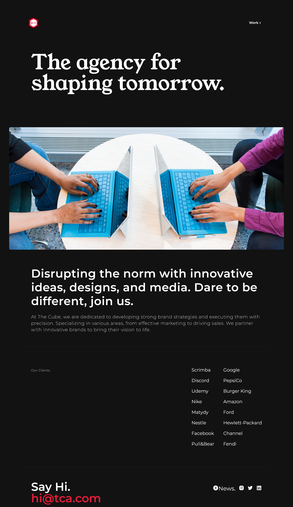
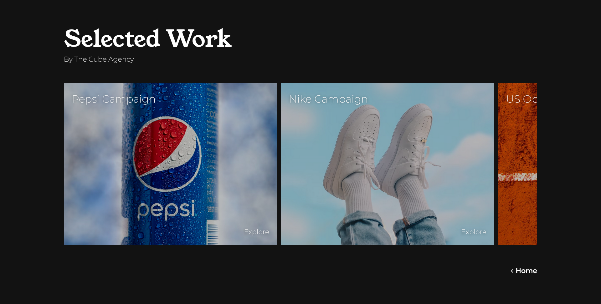

# The cube agency

Fully responsive website for a digital marketing agency using HTML and CSS and JS

## Table of contents

- [Overview](#overview)
  - [Description](#description)
  - [Website features](#website-features)
  - [Screenshots](#screenshots)
  - [Links](#links)
- [Built with](#built-with)
- [Files and Directories](#files-and-directories)
- [Installation](#installation)
- [Author](#author)

## Overview

### Description

The Cube is a digital marketing agency that provides innovative solutions for businesses looking to enhance their online presence. The website is minimalistic and intuitive, allowing for a clean and user-friendly experience. This website is build with HTML, CSS, and Vanilla JavaScript.

### Website Features

- Minimalistic design with a focus on clean and clear navigation
- Nav links that decrease the brightness and blur the rest of the page when hovered over
- Two pages - a landing page and a page showcasing our selected projects via a slide

### Screenshots

### Links

- Solution URL: [https://github.com/fatima-xs/the-cube-agency](https://github.com/fatima-xs/lazy-life-blog)
- Live Site URL: [https://the-cube.netlify.app/](https://lazy-life-fatima.netlify.app/)

## Built with

## Files and Directories

- index.html : the homepage
- work.html : the About Me page
- index.js : the js file
- css : the directory containing the css files
- assets : the directory containing the images

## Installation

- Clone this repository to your desktop
- Navigate to the top level of the directory
- Open ./index.html in your browser

## Author

### Fatimata Ndiaye

